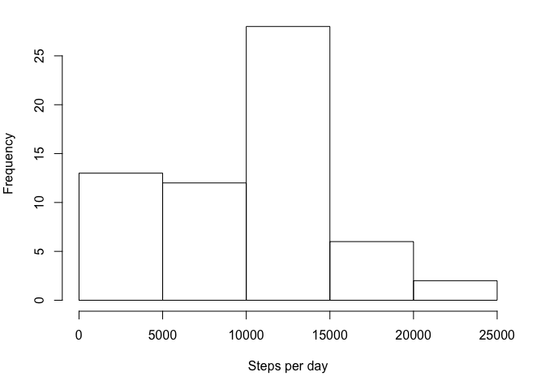

## Loading and preprocessing the data

Load the data:


```r
activity_data <- read.csv("activity.csv")
```

## What is mean total number of steps taken per day?

1. Calculate the total number of steps per day:

```r
# sum number of steps per day
steps_per_day <- with(activity_data, aggregate(steps, list(date), sum, na.rm = TRUE))
names(steps_per_day) <- c("day", "steps")
```

2. Make a histogram of the total number of steps taken each day:

```r
par(mar = c(5, 4, 1, 2))
hist(steps_per_day$steps, xlab = "Steps per day", main = NULL)
```

<!-- -->

3. Calculate the mean and median of the total number of steps taken per day:

```r
mean(steps_per_day$steps)
```

```
## [1] 9354.23
```

```r
median(steps_per_day$steps)
```

```
## [1] 10395
```
So mean = 9354.23 and median = 10395.
Another solution would be to use `summary`: 

```r
summary(steps_per_day$steps)
```

```
##    Min. 1st Qu.  Median    Mean 3rd Qu.    Max. 
##       0    6778   10395    9354   12811   21194
```

## What is the average daily activity pattern?

1. Make a time series plot of the 5-minute interval (x-axis) and the average number of steps taken, averaged across all days (y-axis):

```r
# calculate average of steps per interval
steps_per_interval <- with(activity_data, aggregate(steps, list(interval), mean, na.rm = TRUE))
names(steps_per_interval) <- c("interval", "steps")

plot(steps_per_interval$interval, steps_per_interval$steps, type="l",
     xlab = "Interval", ylab = "Steps")
```

<!-- -->

2. Which 5-minute interval, on average across all the days in the dataset, contains the maximum number of steps?


```r
max_index <- which.max(steps_per_interval$steps)
steps_per_interval$interval[max_index]
```

```
## [1] 835
```
So interval 835 contains the maximum average number of steps.


## Imputing missing values

1. Calculate and report the total number of missing values in the dataset:


```r
# create vector of indexes of NA steps
na_steps_indexes <- is.na(activity_data$steps)
sum(na_steps_indexes)
```

```
## [1] 2304
```
There are 2304 missing values.

2. Strategy for filling in the missing values in the dataset. 

To fill in the missing values, we will use the mean of the corresponding 5-minutes interval.

3. Create a new dataset that is equal to the original dataset but with the missing data filled in.

```r
# create vector of intervals with NA steps
na_steps_intervals <- activity_data$interval[na_steps_indexes]
# find indexes of these intervals in the average steps per interval data frame
match_indexes <- match(na_steps_intervals, steps_per_interval$interval)
# assign the average steps per interval to the NA steps
activity_data$steps[na_steps_indexes] <- round(steps_per_interval$steps[match_indexes])
```
4. Make a histogram of the total number of steps taken each day: 

```r
# sum number of steps per day (this time without NA values)
steps_per_day <- with(activity_data, aggregate(steps, list(date), sum))
names(steps_per_day) <- c("day", "steps")

par(mar = c(5, 4, 1, 2))
hist(steps_per_day$steps, xlab = "Steps per day", main = NULL)
```

<!-- -->

and calculate and report the mean and median total number of steps taken per day:

```r
mean(steps_per_day$steps)
```

```
## [1] 10765.64
```

```r
median(steps_per_day$steps)
```

```
## [1] 10762
```

Do these values differ from the estimates from the first part of the assignment? 
Yes they differ. There are less days with few steps (< 5000) and more days with steps between 10'000 and 15'000. And mean and median are now almost the same. In the first calculation mean was smaller than median.

What is the impact of imputing missing data on the estimates of the total daily number of steps?
The results are more correct.

## Are there differences in activity patterns between weekdays and weekends?

1. Create a new factor variable in the dataset with two levels – “weekday” and “weekend” indicating whether a given date is a weekday or weekend day:


```r
# create vector of weekdays corresponding to dates
activity_weekdays <- weekdays(as.Date(activity_data$date))
# create logical vector if it is a weekend day
is_weekend <- activity_weekdays == "Saturday" | activity_weekdays == "Sunday"
# add variable with the day type to the data frame
activity_data$day_type <- ""
activity_data$day_type[is_weekend] <- "weekend"
activity_data$day_type[!is_weekend] <- "weekday"
```


```r
# calculate the average number of steps per interval and day type
daytype_activity_data <- with(activity_data, aggregate(steps, list(interval, day_type), mean))
names(daytype_activity_data) <- c("interval", "daytype", "steps")

library(lattice)
xyplot(daytype_activity_data$steps ~ daytype_activity_data$interval | daytype_activity_data$daytype, 
               data=daytype_activity_data, type="l", layout=c(1:2),
               ylab="Number of steps",
               xlab="Interval")
```

<!-- -->

